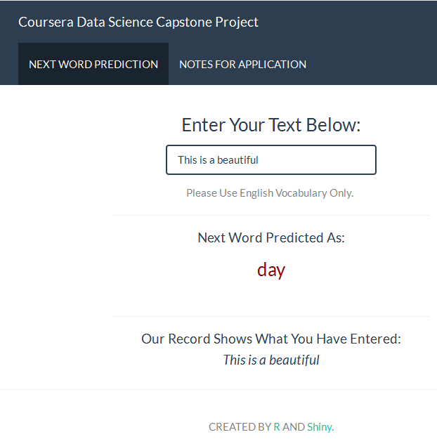

******

#### OBJECTIVES

* Build a shiny application that is able to predict the next word.  
* A corpus has been created from [(Corpus Data Source)](https://d396qusza40orc.cloudfront.net/dsscapstone/dataset/Coursera-SwiftKey.zip) for this project. 
* Multiple R packages (such as tm, stringr, stringi, qdap, RWeka, dplyr, rJava) have been used for text mining and natural language processing.

******

#### APPLIED METHODS AND MODELS

After a Corpus generated, then following clean up steps are performed.  
  
  * Convert to ASCII to eliminate any funny words
  * Convert all words to lowercase
  * Eliminate punctuation
  * Eliminate numbers
  * Strip whitespace
  * Eliminate profan words
  * English stop words
  * Stemming (Using Porter's Stemming Algorithm)
  * Create Plain Text Format

This sampled corpus was then used to creat unigram, bigram, trigram and quadgram [See wikipedia *N-Grams*](http://en.wikipedia.org/wiki/N-gram). 

When an user input text, the resulting data frames are used to predict the next word accroding to the frequencies of the underlying *N-Grams*. If the next word can not be found under current *N-Grams*, following **Stupid Backoff Algorithm** has been use to pick up the most-likely next-wrod:

__Total_prob = 1.0 * QuadGrams_prob + 0.40 * TriGrams_prob 
                + 0.16 * BiGrams_prob + 0.064 * UniGram_prob__

(Note1: __Total_prob__ is not normalized.
 Note2: For this project __Stupid Backoff Algorithm__ is much faster than Kneser-Ney smoothing.)

******

#### HOW TO USE

Mobile users are targeted by this light-weighted application. While entering the text, the predicted next word will be shown instantaneously and what the user just has entered will be displayed for verification purpose.

******

#### REFERENCE

* Nature Language Processing - Smoothing Models [Bill MacCartney](http://nlp.stanford.edu/~wcmac/papers/20050421-smoothing-tutorial.pdf)  
* Nature Language Processing - About N-Gram [Daniel Jurafsky & James H. Martin](https://lagunita.stanford.edu/c4x/Engineering/CS-224N/asset/slp4.pdf)

******

#### LINKS

* The scripts related to this shiny application, as well as the milestone report and the presentation can be found in [this GitHub repository](https://github.com/AlbertShuxiangLi/CapstoneProject).

* My Slid Deck is [HERE](http://rpubs.com/Albert_Shuxiang_Li/173138).