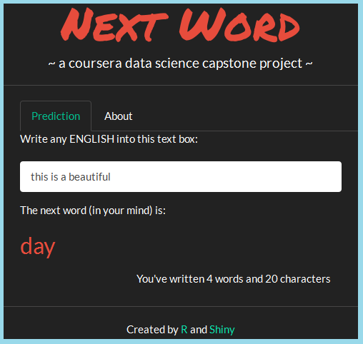

Cousera Capstone Project
========================================================
author: Albert Shuxiang Li
date: 23 April 2016

OBJECTIVES
- Build a shiny application to predict the next word.  
- A corpus has been created from this [{Corpus Data Source}](https://d396qusza40orc.cloudfront.net/dsscapstone/dataset/Coursera-SwiftKey.zip). 
- Multiple R packages (such as tm, stringr, stringi, qdap, RWeka, dplyr, rJava) have been used for text mining and [{NLP}](https://en.wikipedia.org/wiki/Natural_language_processing).

APPLIED METHODS & MODELS (1)
========================================================
##### After a corpus generated, then clean up processes performed.  
  
  * Convert to ASCII to remove any funny characters
  * Convert all words to lowercase
  * Eliminate punctuation / Eliminate numbers
  * Strip whitespace
  * Eliminate profan words / Eliminate English stop words
  * Stemming (Using Porter's Stemming Algorithm)
  * Create Plain Text Format

##### This sampled corpus was then used to creat unigram, bigram, trigram and quadgram [{See wikipedia *N-Grams*}](http://en.wikipedia.org/wiki/N-gram). 

APPLIED METHODS & MODELS (2)
========================================================

- When an user input text, up to last 5 words will be used to predict the next word accroding to the frequencies of the underlying *N-Grams*. 

- Stupid Backoff Algorithm has been implemented as following :

Total_prob = 1*5Gram_prob + 0.4*4Gram_prob + 0.16*3Gram_prob + 0.064*2Gram_prob

HOW TO USE
========================================================

***
- Mobile users are targeted by this light-weighted application. 
- While entering the text, the predicted next word will be shown instantaneously.
- And how many words and characters the user just has entered will be displayed too.

NOTES
========================================================

Following reference has been used
  - Nature Language Processing - Smoothing Models
  [{Bill MacCartney}](http://nlp.stanford.edu/~wcmac/papers/20050421-smoothing-tutorial.pdf)  
  - Nature Language Processing - About N-Gram
  [{Daniel Jurafsky & James H. Martin}](https://lagunita.stanford.edu/c4x/Engineering/CS-224N/asset/slp4.pdf)

My project on github
  - The scripts related to this shiny application, as well as the milestone report and the presentation can be found in [{this GitHub repository}](https://github.com/AlbertShuxiangLi/CapstoneProject).
